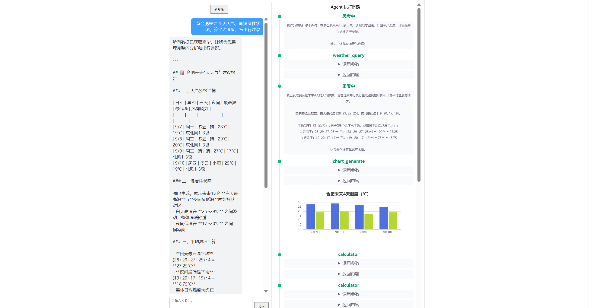
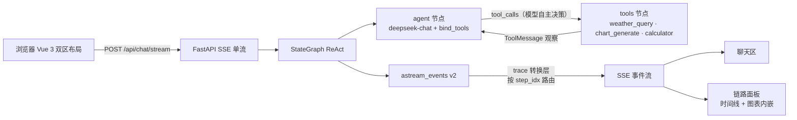

# Web 可视化 AI 工具 Agent（LangGraph 手搭）

一句话指令「**查合肥未来 4 天天气，画温度柱状图，算平均温度，写出行建议**」→ 手搭 LangGraph ReAct Agent 自主分步调用 3 个工具 → 前端**执行链路面板**实时可视化每一步（思考流、工具调用、图表内嵌渲染）。



> 📹 演示 GIF 待补（录制中，随后更新）；面试/演示场景可用一条指令现场跑通全链路。

## 核心亮点

- **可视化执行链路面板**（本项目差异化核心）：步骤时间线 + 状态徽章（思考呼吸动画 / 工具齿轮 / 成功绿 / 失败红）+ 工具参数与返回折叠查看 + ECharts 图表**内嵌卡片渲染**。面板数据全部来自图执行本身的事件流，不是前端事后拼装——这就是"可观测"。
- **手搭 StateGraph**：`agent ⇄ tools` 双节点 + 条件边循环，不用 `create_agent` 黑盒预置——节点粒度可控、每个执行事件可拿来做可视化。
- **trace 事件协议按 `step_idx` 路由**：所有步骤事件自带头部门牌号，前端按 id 路由、与事件到达顺序解耦——**实测扛住模型一轮并行调用多个工具**（联调时 DeepSeek 一次叫了 chart_generate + calculator 两个工具，协议按 id 路由后零串门）。
- **calculator 用 ast 白名单解析**，绝不 eval，防代码注入。
- **chart_generate 确定性生成**：ECharts option 由代码构造，杜绝 LLM 产出非法配置。

## 架构



## 技术栈

| 层 | 技术 |
|---|---|
| 后端 | Python 3.14 · FastAPI · LangGraph 1.2.11（手搭图）· langchain-openai（deepseek-chat）· httpx |
| 前端 | Vue 3 · TypeScript · Vite · ECharts（图表内嵌） |
| 测试 | pytest（15 个用例：工具单测 / 图集成测试 / SSE 契约测试 / trace 协议单测） |
| 部署 | Docker Compose（nginx 托管前端并反代 `/api`，SSE 关缓冲） |

## 快速开始（Docker）

```bash
cp .env.example .env   # 填入 DEEPSEEK_API_KEY、AMAP_API_KEY
docker compose up -d --build
# 浏览器打开 http://localhost
```

- DeepSeek key：https://platform.deepseek.com（国内可直连）
- 高德天气 key：高德开放平台控制台免费申请「Web 服务」key
- 国内拉取镜像慢的话，给 Docker 配置 registry mirror（`daemon.json` 的 `registry-mirrors`）

## 本地开发

```powershell
# 后端（:8000）
cd backend; py -3.14 -m venv .venv; .\.venv\Scripts\python.exe -m pip install -r requirements.txt
.\.venv\Scripts\python.exe -m uvicorn main:app --port 8000

# 前端（:5173，/api 已 proxy 到 8000）
cd frontend; npm install; npm run dev

# 测试
cd backend; .\.venv\Scripts\python.exe -m pytest tests/ -v
```

## 演示

发送指令（聊天区输入）：

> 查合肥未来 4 天天气，画温度柱状图，算平均温度，写出行建议

期望行为：链路面板依次点亮 **思考 → weather_query → 思考 → chart_generate → 思考 → calculator → 思考**，柱状图内嵌渲染在 chart_generate 卡片里，最终聊天区给出含出行建议的回答。步骤数量与工具顺序由模型自主决策（可能一轮并行调多个工具、也可能换序）——协议按 `step_idx` 路由，任意形状都不串门。

## trace 事件协议（SSE 单流）

| 事件 | data | 含义 |
|---|---|---|
| `start` | `{}` | 握手 |
| `step_start` | `{step_idx, type: "thinking"\|"tool"}` | 步骤开始（时间线新条目） |
| `thinking` | `{step_idx, text}` | LLM 思考流式文本 |
| `tool_call` | `{step_idx, tool_name, args}` | 模型决定调用工具 |
| `tool_result` | `{step_idx, tool_name, result, ok}` | 工具执行结果（ok=false 即错误观察） |
| `chart` | `{step_idx, option}` | chart_generate 产物，前端直接 setOption |
| `step_end` | `{step_idx}` | 步骤结束 |
| `answer` | `{text}` | 最终回答全文 |
| `done` | `{}` | 结束 |
| `error` | `{detail}` | 异常兜底 |

步骤事件全部按 `step_idx` 路由：工具步 id 在模型回合结束时依次入 FIFO 队列、工具执行完成时按序领取——协议自描述、消费方无状态。

## 验收清单

1. ✅ 一句话指令 → 面板看到多步骤、3 种工具、ReAct 多轮循环
2. ✅ 柱状图正确渲染在面板内（option 由 chart_generate 确定性生成）
3. ✅ 链路面板实时点亮（思考动画 → 工具齿轮 → 结果 → 图表），截图存档 `screenshots/`
4. ✅ docker compose up 一键启动（演示 GIF 待补）
5. ✅ 已推 GitHub

## 面试口径（每个组件的"为什么"）

| 组件 | 口径 |
|---|---|
| 手搭 StateGraph | "create_agent 是黑盒预置，手搭让我控制节点粒度、能拿到每个节点的执行事件做可视化" |
| Function Calling | "模型不是被 if 控制——把工具 schema 喂给模型，模型自主输出 tool_call，框架执行回传，这就是 Function Calling" |
| 按 id 路由 | "联调时模型一轮并行调了两个工具，暴露了'最后一条目'定位的串门 bug；升级为事件自带 step_idx 按 id 路由，协议自描述、与到达顺序解耦，任意并行形状都不错位" |
| chart_generate 确定性 | "图表配置由代码确定性生成，不依赖模型输出——杜绝 LLM 生成非法 ECharts option" |
| calculator 安全 | "用 ast 白名单解析而不是 eval，防代码注入" |
| 失败重试 | "工具失败返回错误文本进观察环节，模型自主决定重试或放弃——ReAct 的天然容错；recursion_limit 兜底防死循环" |
| 可观测 | "链路面板数据全部来自图执行本身的事件流，不是前端事后拼装" |
| SSE 选型 | "单向事件流用 SSE 足够，比 WebSocket 更简单且代理友好；nginx 关 proxy_buffering 即可" |
| 不做项 | "v1 不做 Planner 任务分解、多工具并行、Memory 持久化——YAGNI，场景不需要；这是 v2 路线" |

## 已知取舍

- 前端 bundle 约 1.18MB（echarts 全家桶）——演示项目可接受，按需引入是优化路线
- 对话不持久化（每次刷新即新会话）——v2 可加 Memory
- 演示 GIF 待补
